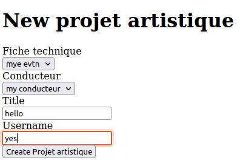
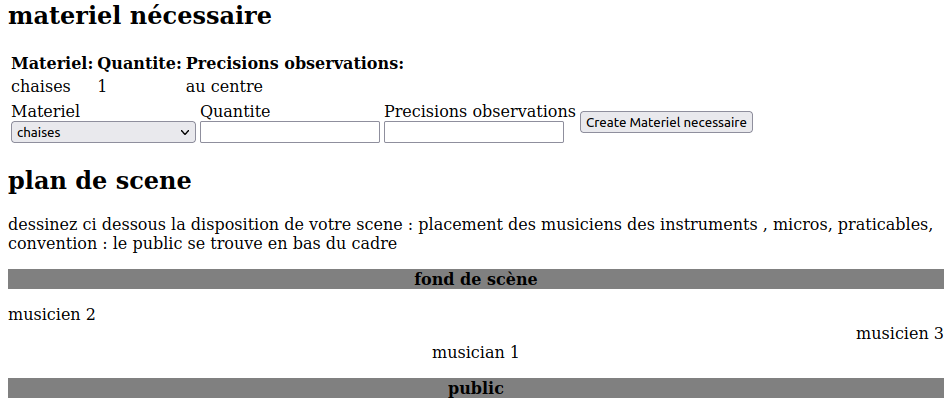
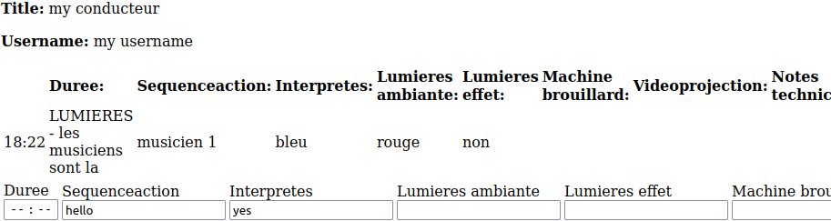

# README

- cree des conducteur au hasard : rails db:seed
# conducteur-fiche-technique
- python3 improvedscript
* python3 improvednuancenote.py
* rails "search:suggest[Rock]"
- visit https://illuminated-integration.com/blog/stage-lighting-for-dance/
- chercher sur google
do you need telling a tsory to convey emotions in dance
- chercher sur google
do you need telling a tsory to convey emotions in music : 
No need. Music can convey emotions, inspire imagination, and express ideas through different musical structures, beats, and timbres. It can achieve good results without telling a story or conveying specific information
